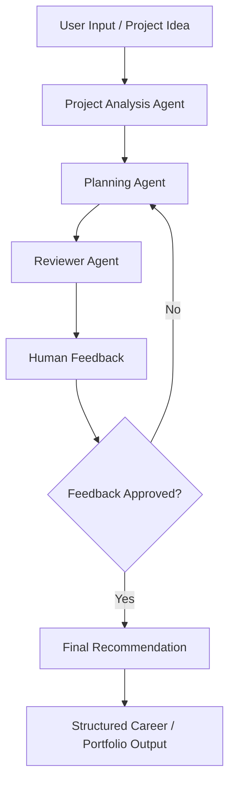

# 🧠 AI Career Project Strategist — LangGraph Workflow

<p align="left">
  
  
  
  
  
  
  
</p>

A Google Colab-based **multi-agent LangGraph workflow** designed to help with AI career project planning, review, and structured feedback.

The project explores how AI agents can collaborate in a workflow to analyze a project idea, suggest improvements, review outputs, and include human feedback before producing a final recommendation.

---

## ✨ Highlights

- 🧠 Multi-agent workflow logic
- 🧰 Agent tools and structured task execution
- 🔁 Human-in-the-loop feedback
- 🧭 Project planning and review flow
- 📋 Structured recommendations
- 🧪 Google Colab prototyping
- 🤖 LangGraph / LangChain-style agent architecture
- 🎯 Career and portfolio project strategy use case

---

## 🧭 Workflow Overview



---

## 🛠️ Tech Stack

| Category | Tools |
|----------|-------|
| Language | Python |
| Environment | Google Colab |
| Agent Workflow | LangGraph concepts |
| Agent Tools | LangChain concepts |
| LLM / API | OpenAI API |
| Workflow Pattern | Multi-agent system |
| Interaction | Human-in-the-loop feedback |

---

## 📚 What This Project Demonstrates

This project demonstrates practical understanding of:

- AI agent workflow design
- LangGraph-style multi-step execution
- structured project analysis
- human-in-the-loop review
- AI-assisted career/project planning
- agent-based reasoning workflows
- practical use of LLMs for decision support

---

## 🔄 Agent Workflow Logic

The workflow follows a structured process:

1. The user provides a project idea or career/project context
2. The first agent analyzes the input
3. A planning agent suggests improvements or next steps
4. A reviewer agent evaluates the proposed output
5. Human feedback is added into the loop
6. The workflow either revises the output or produces a final recommendation

---

## 🎯 Project Purpose

This project was built as part of my AI agents and workflows learning path.

It is designed as a portfolio project showing how agentic workflows can support:

- career planning
- project strategy
- portfolio improvement
- structured decision-making
- AI-assisted feedback loops

---

## 📁 Repository Contents

```text
ai-career-project-strategist-langgraph/
├── AI_Career_Project_Strategist_LangGraph.ipynb
└── README.md
```

---

## ⚙️ Requirements

To run the notebook successfully, you may need:

- Google Colab
- Python 3.x
- OpenAI API key
- LangGraph / LangChain-related libraries, depending on notebook setup

> **Important:** Do not commit API keys or private credentials to this repository.

---

## 🔮 Possible Future Improvements

- Add a clearer visual interface for user inputs
- Add more specialized agents
- Improve memory and state handling
- Add stronger evaluation criteria
- Export final recommendations as PDF / Markdown
- Connect the workflow to a real portfolio database
- Turn the notebook into a small web app

---

## 👤 Author

**Stefan Badev**  
AI & Automation Builder • AI-Assisted Development • Workflows • Chatbots • AI Agents

- GitHub: [s-badev](https://github.com/s-badev)
- LinkedIn: [Stefan Badev](https://www.linkedin.com/in/stefan-badev-788460158)

---

## 📄 Status

✅ Portfolio / educational project  
✅ Google Colab notebook  
✅ Suitable for CV / LinkedIn portfolio presentation
